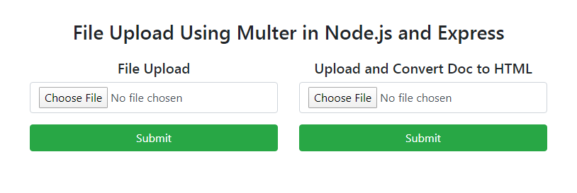
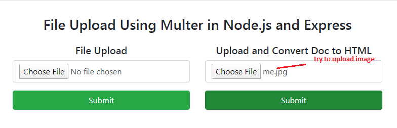
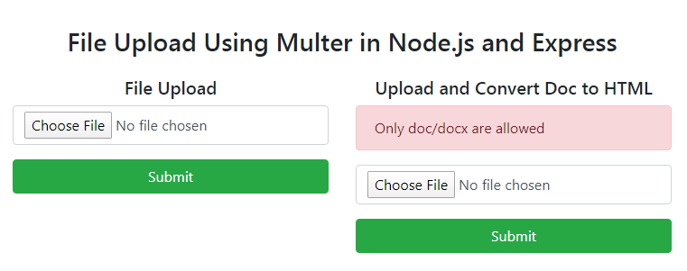
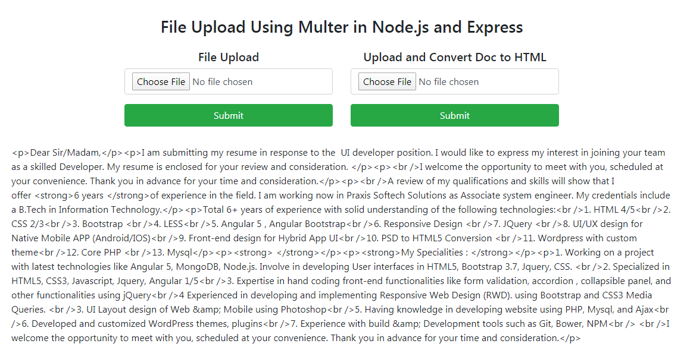

# Run Application
``` 
nodemon app.js
``` 





### File Upload Using Multer in Node.js and Express
https://www.npmjs.com/package/multer
https://www.youtube.com/watch?v=9JAkmAuHC8s
https://medium.com/@bmshamsnahid/nodejs-file-upload-using-multer-3a904516f6d2
https://medium.com/@svibhuti22/file-upload-with-multer-in-node-js-and-express-5bc76073419f

### You might want to setup like this if you're having issues with passing the multer function to app.use 
``` 
var upload = multer({ dest: 'uploads/' }); 
var app = express() app.post('/profile', upload.single('field-name'), function (req, res, next) { console.log(req.file); })
``` 